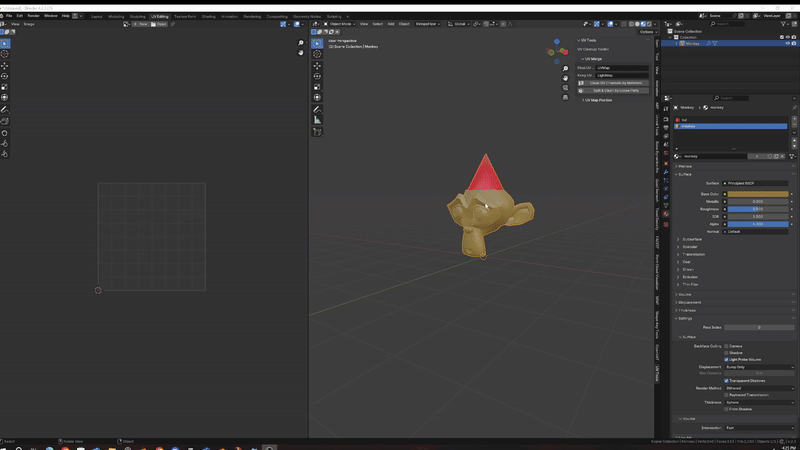
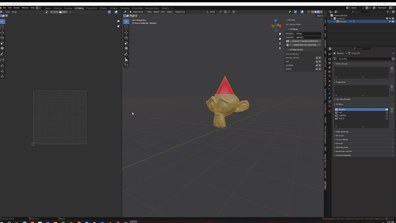

# UV Channel Cleaner

**UV Channel Cleaner** is a Blender addon designed to automatically clean up and merge UV channels. It selects the best UV map based on quality metrics and removes the rest — with support for preserving specific maps and reordering UV layers.

## Features

- Merge UV channels by materials or by loose parts
- Automatically selects the best UV map based on scoring
- Deletes bad UV maps
- Lets you exclude specific UV maps from deletion
- Change UV map position
- Includes a user panel in the 3D Viewport (UV Tools tab)

## Installation

1. Download the script `uv_channel_cleaner.py`
2. In Blender: go to `Edit > Preferences > Add-ons > Install...`
3. Select the script file and enable the addon

## How to Use

1. In the 3D Viewport, open the right-hand sidebar
2. Go to the **UV Tools** tab
3. Use **Clean by Materials** or **Clean by Loose Parts** depending on your workflow

**Settings:**
- **Final UV Name** — The name for the best UV map that will be preserved
- **Keep UV Channels** — Comma-separated list of UV names to exclude from removal

**UV Map Reordering:**
Use the **UV Map Order** panel to move UV layers up or down. Blender doesn’t provide a native way to reorder them — this tool fills that gap by rebuilding the stack manually.

## License

Free for indie developers and small teams with yearly revenue under $100,000.

Commercial or studio use requires a license.  
Please contact the author directly for licensing details:

**Contact:** bogdanfrolov04@gmail.com

See full terms in: [LICENSE](LICENSE.txt)

## Support the Project

If this addon saves you time or frustration, consider supporting further development:

[Buy Me a Coffee]([https://www.buymeacoffee.com/naughtymonk])  or  [PayPal](https://paypal.me/bogdanfrolov04@gmail.com)

Thank you for your support!
